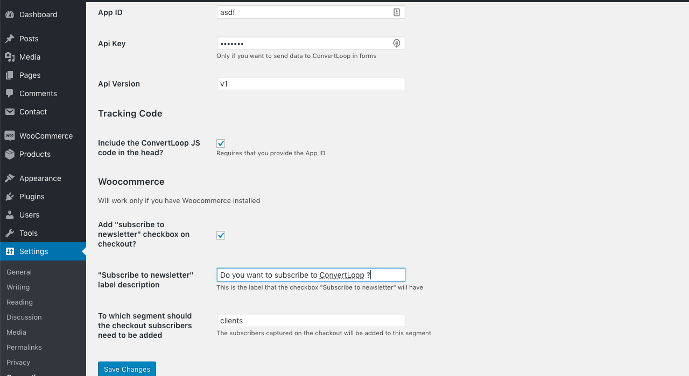
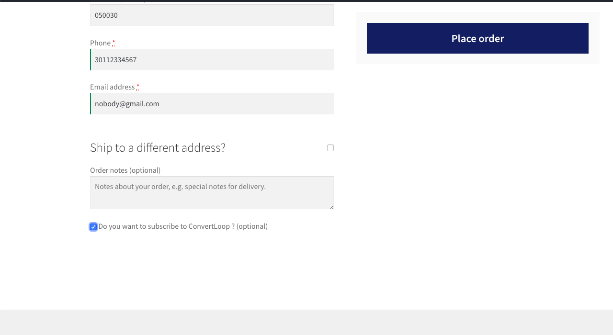
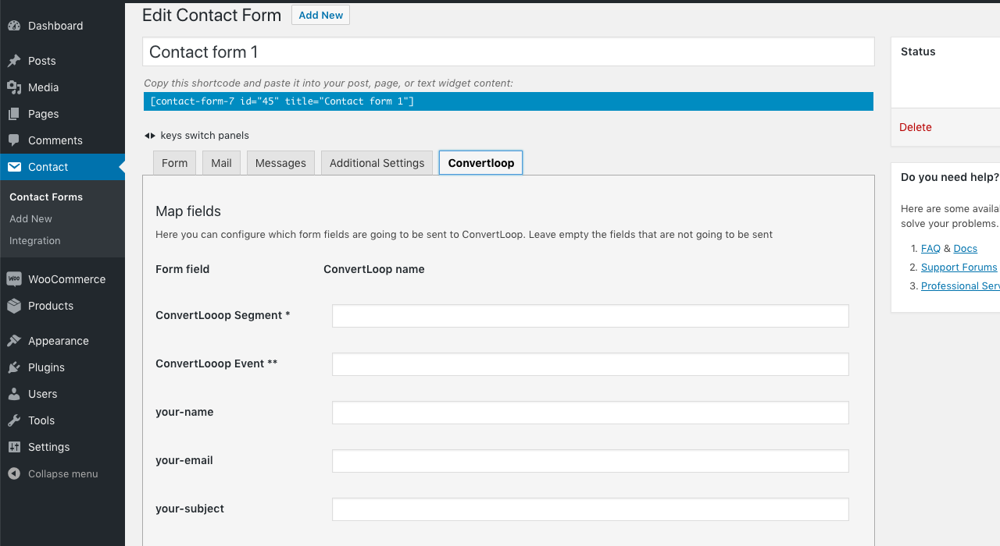

# Wordpress ConvertLoop Plugin

Integrates [ConvertLoop](https://convertloop.co) with Wordpress

Add options in **Contact Form 7** and **Woocommerce** to register users in ConvertLoop. Also adds the ConvertLoop tracking code in the Wordpress header








For this plugin to work, you need an ApiID and ApiKey which can be retreived in your [convertloop account](https://convertloop.co/account) (in WebTracking > Tracking Code section)
## Development setup

```bash
cd /path/to/wp/wp-content/plugins/
git clone git@github.com:Dazzet/convertloop-wordpress.git
cd convertloop-wordpress
composer install
```

## Deployment on a test server

You can save this script in a file called `deploy.sh` changing the `path` and the `username` of the remote server

```bash
REMOTE_USER=myusername
REMOTE_SERVER=example.com
REMOTE_PATH=/path/to/wp/wp-content/plugins/`basename ${PWD}` # No trailing '/'
EXCLUDE="--exclude=.* --exclude=*.zip --exclude=*.md --exclude=composer* --exclude=*.sh"

echo "Syncing to ${REMOTE_PATH} on ${REMOTE_SERVER}"
sleep 3

composer dump-autoload --no-dev -o

rsync -avz -e ssh --delete ${EXCLUDE} ./* ${REMOTE_USER}@${REMOTE_SERVER}:${REMOTE_PATH}/
```

## Create zip plugin file

```bash
composer dump-autoload --no-dev -o
composer zip
```

## Translation

You can use loco-translate for the string extraction and translation. Be sure to save the `.pot` file in the `languages` directory
